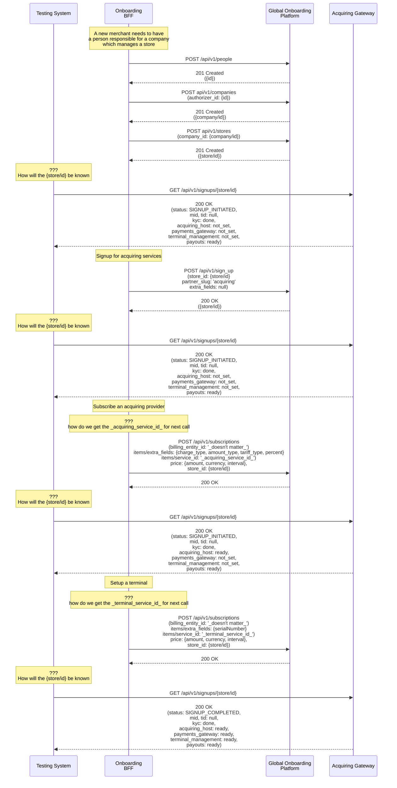

# Onboarding E2E flow

```mermaid
sequenceDiagram
  participant TS as Testing System
  participant BFF as Onboarding <br/> BFF
  participant GOP as Global Onboarding <br/> Platform
  participant AGW as Acquiring Gateway


  %%
  %% New merchant
  %%

  Note over BFF: A new merchant needs to have <br/> a person responsible for a company <br/> which manages a store

  BFF ->> GOP: POST /api/v1/people
  GOP -->> BFF: 201 Created <br/> ({id})
  
  BFF ->> GOP: POST api/v1/companies <br/> (authorizer_id: {id})
  GOP -->> BFF: 201 Created <br/> ({company/id})

  BFF ->> GOP: POST api/v1/stores <br/> (company_id: {company/id})
  GOP -->> BFF: 201 Created <br/> ({store/id})


  Note over TS: ??? <br/> How will the {store/id} be known
  TS ->> AGW: GET /api/v1/signups/{store/id}
  AGW -->> TS: 200 OK <br/> (status: SIGNUP_INITIATED, <br/> mid, tid: null, <br/> kyc: done, <br/> acquiring_host: not_set, <br/> payments_gateway: not_set, <br/> terminal_management: not_set, <br/> payouts: ready)

  %%
  %% Acquiring services
  %%

  Note over BFF: Signup for acquiring services

  BFF ->> GOP: POST /api/v1/sign_up <br/> (store_id: {store/id} <br/> partner_slug: 'acquiring' <br/> extra_fields: null)
  GOP -->> BFF: 200 OK <br/> ({store/id})

  Note over TS: ??? <br/> How will the {store/id} be known
  TS ->> AGW: GET /api/v1/signups/{store/id}
  AGW -->> TS: 200 OK <br/> (status: SIGNUP_INITIATED, <br/> mid, tid: null, <br/> kyc: done, <br/> acquiring_host: not_set, <br/> payments_gateway: not_set, <br/> terminal_management: not_set, <br/> payouts: ready)


  %%
  %% Acquiring host
  %%

  Note over BFF: Subscribe an acquiring provider

  Note over BFF: ??? <br/> how do we get the _acquiring_service_id_ for next call
  BFF ->> GOP: POST /api/v1/subscriptions <br/> (billing_entity_id: '_doesn't matter_') <br/> items/extra_fields: {charge_type, amount_type, tariff_type, percent} <br/> items/service_id: '_acquiring_service_id_') <br/> price: {amount, currency, interval}, <br/> store_id: {store/id})
  GOP -->> BFF: 200 OK

  Note over TS: ??? <br/> How will the {store/id} be known
  TS ->> AGW: GET /api/v1/signups/{store/id}
  AGW -->> TS: 200 OK <br/> (status: SIGNUP_INITIATED, <br/> mid, tid: null, <br/> kyc: done, <br/> acquiring_host: ready, <br/> payments_gateway: not_set, <br/> terminal_management: not_set, <br/> payouts: ready)

  %%
  %% Terminal
  %%

  Note over BFF: Setup a terminal

  Note over BFF: ??? <br/> how do we get the _terminal_service_id_ for next call
  BFF ->> GOP: POST /api/v1/subscriptions <br/> (billing_entity_id: '_doesn't matter_') <br/> items/extra_fields: {serialNumber} <br/> items/service_id: '_terminal_service_id_') <br/> price: {amount, currency, interval}, <br/> store_id: {store/id})
  GOP -->> BFF: 200 OK

  Note over TS: ??? <br/> How will the {store/id} be known
  TS ->> AGW: GET /api/v1/signups/{store/id}
  AGW -->> TS: 200 OK <br/> (status: SIGNUP_COMPLETED, <br/> mid, tid: null, <br/> kyc: done, <br/> acquiring_host: ready, <br/> payments_gateway: ready, <br/> terminal_management: ready, <br/> payouts: ready)


```
