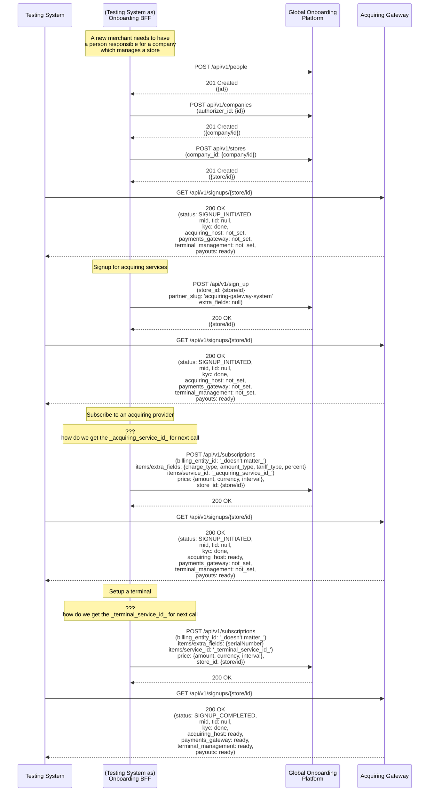

# Onboarding E2E flow

For the time being the E2E trigger comes from the Onboarding Backend for Frontend (BFF) and not from the Onboarding UI call to BFF. In time this will be evaluated to assess how feasible it is to have the E2E test start one system upstream.

Even though we are doing blackbox testing, some business rules should also be checked. As such the test is more of greybox in the sense that it crosses a bit the blackbox boundary to ensure the merchant is known to all the relevant systems.

